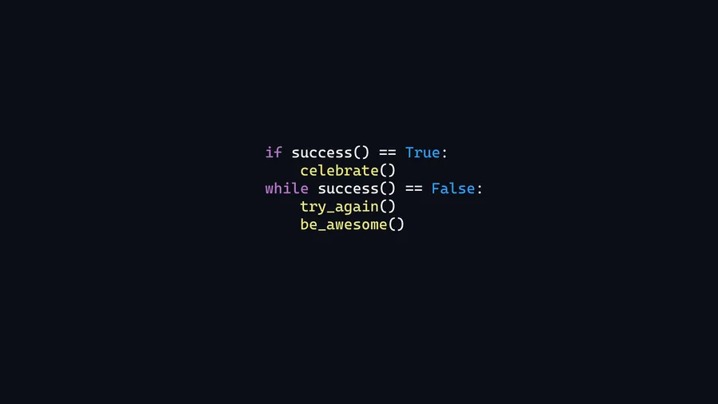

<h1 align="center">
  
  <br>
  💻 Amr Tarek  |  Building with Angular 
  <br>
  
</h1>

<p align="center">

  
</p>

<!-- نبذة التعريف -->
---

## 🚀 About Me

Hi! I'm **Amr Tarek**, a passionate **frontend developer** specialized in **Angular**.  
I craft elegant, performant, and modern UIs with a strong focus on animation and user experience.

- 🎯 **Focus**: Angular, HTML, CSS, TypeScript, TailwindCSS, PrimeNG
- ✨ **Interested in**: UI/UX Design, Web Animation, Web Performance
- 🤝 **Open for**: Collaboration on awesome frontend projects!
- 💼 **Experience**: 2+ years building scalable Angular applications
- 📫 **Reach me at**: [amryousef04@gmail.com](mailto:amryousef04@gmail.com)
- 📄 **[My Resume](https://drive.google.com/file/d/1QP9En3nfsPfAHTvypJgMwQrqvLAsa6Fi/view?usp=drive_link)**

---

## 🎯 Featured Projects & Time Tracking

<div align="center">

| 📁 Project             | ⏱️ WakaTime Stats                                  |
|:--------------------:|:----------------------------------------------------:|
| Luxor University AR   | [](https://wakatime.com/badge/user/316915ee-18a4-4cb5-9ca0-ab41994bb7e3/project/3d38901e-414d-4122-866d-7173fefb7042) |
| Luxor Website AR       | [](https://wakatime.com/badge/user/316915ee-18a4-4cb5-9ca0-ab41994bb7e3/project/f142e480-1aac-4c0e-a7e7-2a590d05d9f1) |
| Advidor Project       | [](https://wakatime.com/badge/user/316915ee-18a4-4cb5-9ca0-ab41994bb7e3/project/2475e592-e411-4597-80e9-432b9c7c5338) |

</div>

---

## 🔥 Developer Productivity (Powered by WakaTime)

<div align="center">

🕒 **Tracking Code Time Automatically**  
🎯 _Updated every day via GitHub Actions_

</div>

<br>

<div align="center">
  


</div>

> *(Auto-updated every commit ⏳)*

📊 Productivity Report
======================

#### 📅 From: **20 November 2025**  
#### 📅 To:   **27 November 2025**  

#### ⏰ **Total Coding Time:** `49 hrs 22 mins`

---

🧠 Languages Breakdown
----------------------

| Language       | Time            | Bar                                   |   %     |
|----------------|-----------------|---------------------------------------|---------|
| 💙 TypeScript  | 33 hrs 33 mins  | ███████████████░░░░░░░░               | 67.97% |
| 🧡 HTML        | 10 hrs 58 mins  | ████████░░░░░░░░░░░░░░░               | 22.22% |
| 💜 Markdown    | 27 mins         | ██░░░░░░░░░░░░░░░░░░░░░               | 00.94% |
| 💚 SCSS        | 16 mins         | █░░░░░░░░░░░░░░░░░░░░░░░              | 00.56% |
| 💛 CSS         | 0 secs          | ░░░░░░░░░░░░░░░░░░░░░░░░              | 00.01% |
| ⚙️ Other       | 0 secs          | ░░░░░░░░░░░░░░░░░░░░░░░░              | 00.01% |


### 📈 Raw WakaTime Stats (Auto Source) 👇

> *(Bot updates this section — do NOT edit)*
<br>
<!--START_SECTION:waka-->

```txt
From: 09 December 2025 - To: 16 December 2025

Total Time: 42 hrs 3 mins

TypeScript   27 hrs 6 mins   >>>>>>>>>>>>>>>>---------   64.20 %
HTML         11 hrs 12 mins  >>>>>>>------------------   26.55 %
CSS          1 hr 35 mins    >------------------------   03.76 %
SCSS         37 mins         -------------------------   01.48 %
Markdown     21 mins         -------------------------   00.86 %
Other        9 mins          -------------------------   00.38 %
```

<!--END_SECTION:waka-->

<br>

<!-- <div>
  📊 Productivity Report
======================

📅 From: 15 November 2025  
📅 To:   22 November 2025  

⏰ Total Coding Time: 8 hrs 38 mins


🧠 Languages Breakdown
----------------------

💙 TypeScript   5 hrs 8 mins  | ███████████████░░░░░ | 59.40%
🧡 HTML         2 hrs 27 mins | ████████░░░░░░░░░░░ | 28.40%
💜 Markdown     23 mins       | ██░░░░░░░░░░░░░░░░░ | 04.55%
💚 SCSS         19 mins       | █░░░░░░░░░░░░░░░░░░░ | 03.76%
💛 CSS          0 secs        | ░░░░░░░░░░░░░░░░░░░░ | 00.03%
⚙️ Other        0 secs        | ░░░░░░░░░░░░░░░░░░░░ | 00.03%
</div>

<div align="center">

⌛ _Consistency beats motivation — Keep writing code._

</div> -->

---

## 🧑‍💻 Angular Tech Stack & Tools

<p align="center">
    <b>Core Technologies</b>
  <br>  <br>  
  
  
  
  
  
  
  
  
  
  
</p>


---

## 🌐 Connect with Me

<div align="center">
  <a href="https://www.linkedin.com/in/عمرو-طارق-82960a319" target="_blank"></a>
  <a href="https://discordapp.com/users/amrtarek77" target="_blank"></a>
  <a href="https://wa.me/qr/QCP4LFGEPSAWI1" target="_blank"></a>
  <a href="https://www.facebook.com/share/19rCEsbULa/" target="_blank"></a>
  <a href="https://x.com/Amr_Tarek722?s=08" target="_blank"></a>
</div>

---

## 📊 GitHub Analytics

<p align="center">
</p>

<p align="center">
  
</p>

<p align="center">
  
</p>

<p align="center">
  
  
</p>


---

<p align="center">
  
</p>

<h3 align="center">✨ Thanks for visiting my profile ✨</h3>
<h4 align="center">❤️ Crafted with passion by Amr Tarek</h4>
<br>

<table align="center">
  <tr>
    <td align="center">
     <a href="https://github.com/AmrTarek7">
        
        <br />
        <sub><b>Amr Tarek Abd El-Fatah</b></sub>
      </a>
    </td>
  </tr>
</table>

<p align="center">
  
</p>
